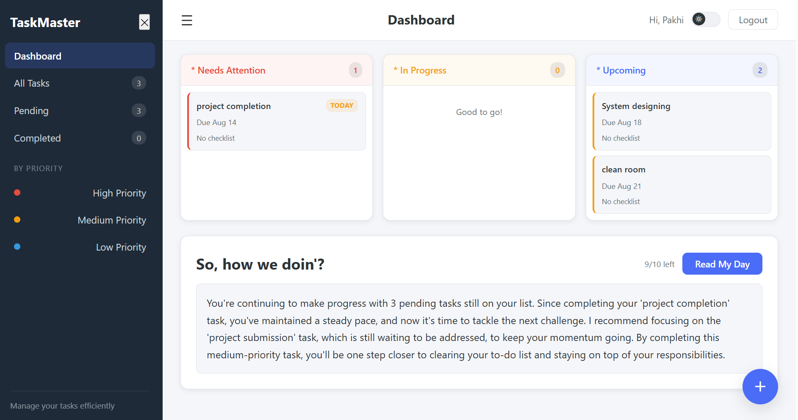
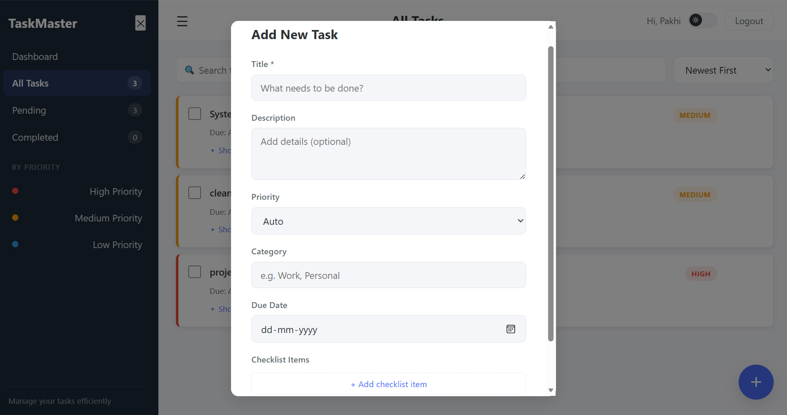
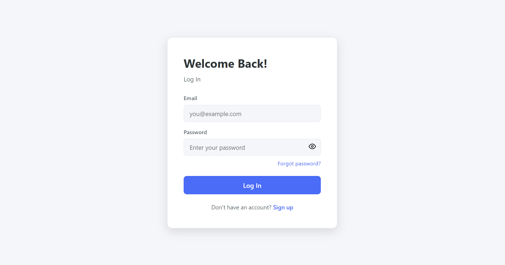

# Smart TaskMaster 

**Live Deployment:** [https://smart-taskmaster.vercel.app/](https://smart-taskmaster.vercel.app/)

## Overview
Smart TaskMaster is a full-stack, AI-augmented productivity application designed to help users organize, track, and manage their daily workflows. Featuring a secure authentication system, an intuitive Kanban-style dashboard, and AI-driven daily briefings, it ensures you stay focused on your highest-priority tasks.

## Screenshots

**Main Dashboard & AI Briefing**


**Task Creation & Priority Tagging**


**Secure User Authentication**


---

## Features

*   **Secure Access:** Full JWT-based authentication system (Login, Registration, Password Recovery).
*   **Smart Dashboard:** Visual categorizations of tasks (Needs Attention, In Progress, Upcoming).
*   **AI Daily Briefing:** Automated, context-aware summaries of your pending workload to guide your daily focus.
*   **Advanced Task Management:** Create, edit, and delete tasks with custom priorities, categories, and due dates.
*   **Responsive UI:** Clean, modern interface with a togglable dark/light mode for optimal accessibility.

## Tech Stack

| Architecture | Technology |
| :--- | :--- |
| **Frontend** | React, TypeScript, Vite |
| **Backend** | Spring Boot (Java) |
| **Database** | PostgreSQL |
| **Security** | JSON Web Tokens (JWT), BCrypt |

---

## System Requirements & Prerequisites

To run this project locally, ensure you have the following installed on your machine:

*   **Java Development Kit (JDK) 17 or higher**
    *   To verify your version, open your terminal and run: `java -version`
    *   If you do not have it installed, download it from the [Oracle official site](https://www.oracle.com/java/technologies/javase/jdk17-archive-downloads.html) or [Adoptium (Eclipse Temurin)](https://adoptium.net/).
*   **Node.js (v18+) and npm:** Required for managing and running the React frontend dependencies.
*   **Apache Maven:** For building and managing the Spring Boot backend.
*   **PostgreSQL:** Relational database for persistent data storage.
*   **Git:** For version control and cloning the repository.
*   **IDE:** Visual Studio Code (VS Code) or Eclipse preferred.
*   **Postman:** Recommended for testing and interacting with the backend REST APIs.

---

## Local Setup Instructions

**1. Clone the repository**
```bash
git clone https://github.com/your-username/smart-taskmaster.git
cd smart-taskmaster
```

**2. Database Configuration**
*   Create a new PostgreSQL database named `taskmaster_db`.
*   Update the `application.properties` (or `application.yml`) file in the Spring Boot backend with your local database credentials (username and password).

**3. Run the Backend (Spring Boot)**
Open a terminal in the project root and navigate to the backend directory:
```bash
cd backend
mvn clean install
mvn spring-boot:run
```
Ensure build success and complete Postman testing

## 4. Run the Frontend (React / Vite)
Open a new terminal window and navigate to the frontend directory:
```bash
cd frontend
npm install
npm run dev
```
For developement purposes, the site will deploy locally at 'http://localhost:8080'

---
